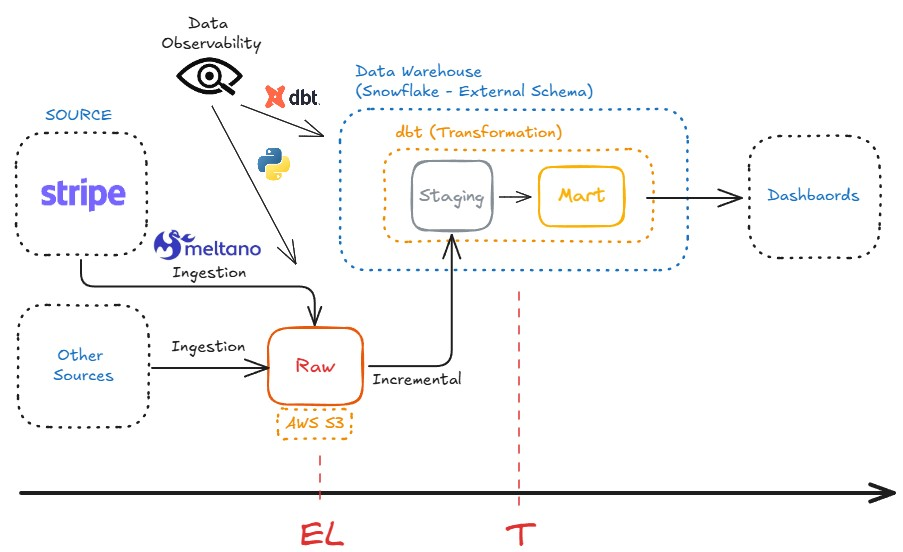
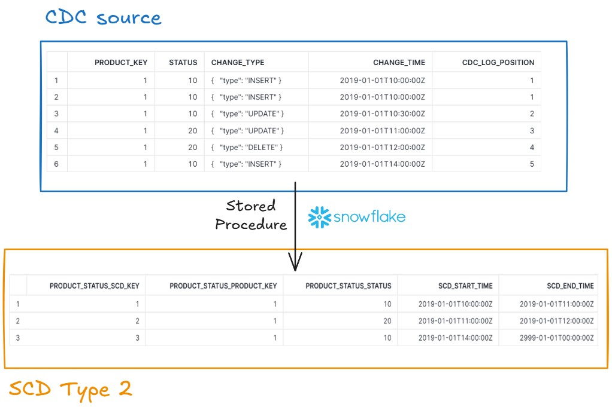
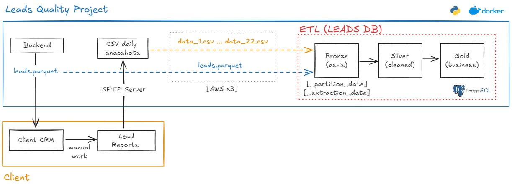
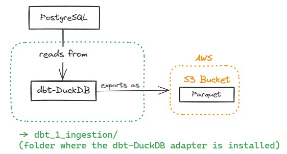
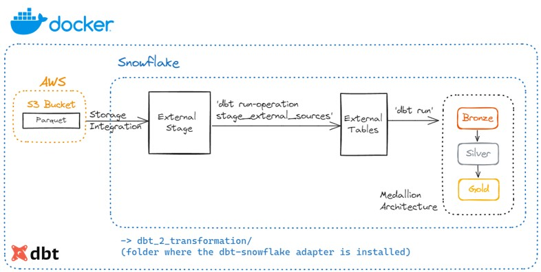
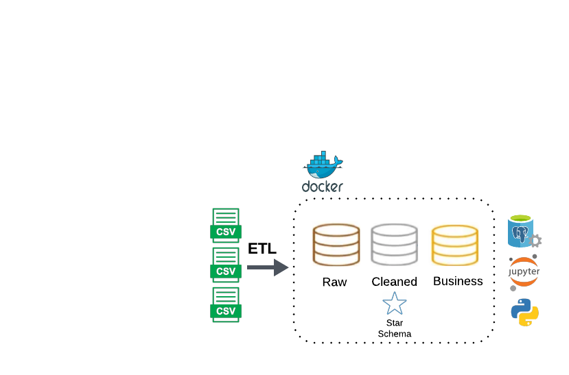
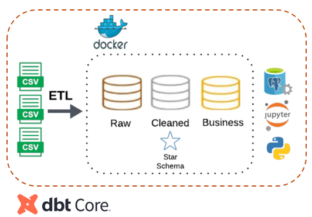
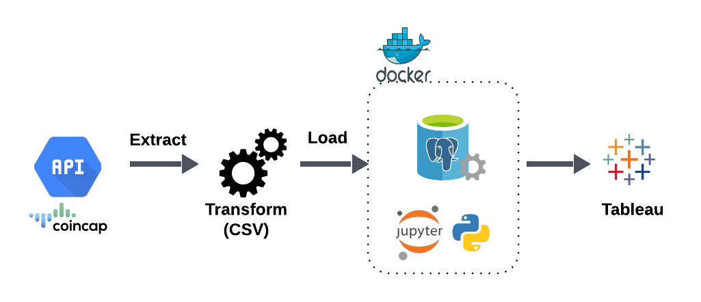
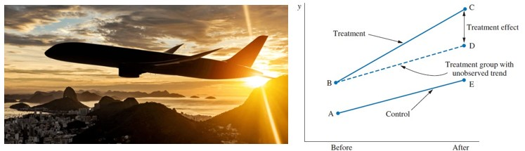

I’m a Mechanical Engineer from Brazil with a Master’s in Economics & Public Policy from UCLA. In 2021, I left a PhD in Economics in the Netherlands to take care of my family during the pandemic and transitioned fully into **Data Science**.

My journey blends **engineering, economics, and data**, with experience spanning Business Analysis, Consulting, Data & Analytics Engineering, and Data Science across the US, UK, Spain, and Brazil. I thrive at the intersection of **advanced analytics and real-world impact**.

Along the way, I’ve been honored with awards and scholarships from **Yale University, UCLA, General Electric Foundation, Lemann Foundation, and The Club of Rome**. Earlier in my career, I helped build **Stone Payments (NASDAQ: STNE)** and founded **MePrepara**, an online math prep platform with 140+ videos that helped low-income Brazilian students prepare for GRE/GMAT exams.

I bring not only strong technical skills (Python, SQL, dbt, Snowflake/Redshift, AWS, Looker, Advanced Mathematics, Statistics, Econometrics, and Machine Learning) but also **entrepreneurial drive, teaching ability, and leadership**. Education changed my life, and I aim to use data and technology to create the same opportunities for others.

# Projects
* **[Data & Analytics Engineering](#data-engineering)**
  * _Tech Stack: SQL, Python, Meltano, dbt, Snowflake, AWS, Github Actions, CI-CD_
  * [Data Observability for Raw Stripe Data in S3 with CI-CD](#data-observability-for-raw-stripe-data-in-s3-with-ci-cd)
  * [Implementing CDC with SCD Techniques: CDC Source -> SCD Type 2](#implementing-an-scd-type-2-dimension-from-a-cdc-source-using-snowflakess-stored-procedure-and-data-quality-checks)
  * [Lead Quality Process: AWS S3 Bucket (Parquet, CSVs) -> Postgres](#lead-quality-process-reading-parquet-and-csvs-from-s3---transforming-with-object-oriented-design---postgres-bronze-silver-gold-layers)
  * [Part 1 - Ingestion - dbt-DuckDB: Postgres -> AWS S3 Bucket (Parquet)](#part-1-of-2---leveraging-dbt-duckdb-to-perform-an-ingestion-step-postgres---aws-s3-bucket-parquet)
  * [Part 2 - Transformation - dbt-Snowflake: AWS S3 Bucket (Parquet) -> Snowflake External Tables](#part-2-of-2---leveraging-dbt-snowflake-to-perform-a-transformation-step-parquet-in-s3---snowflake-external-tables---transformation-in-snowflake-via-dbt)
  * [ETL for Machine Learning (Churn Prediction)](#etl-medallion-architecture-and-kimball-dimensional-modeling-for-machine-learning-churn-prediction-with-dockerized-postgres-jupyter-notebook-and-python)
  * [Migrating ETL to dbt](#migrating-etl-medallion-architecture-and-kimball-dimensional-modeling-to-dbt-with-dockerized-postgres-jupyter-notebook-and-dbt)
  * [ETL from Crypto API to Tableau](#etl-pipeline-from-crypto-api-to-tableau-csv-with-dockerized-postgres-jupyter-notebook-and-python)
* **[Applied Data Science and Machine Learning](#applied-data-science-and-machine-learning)**
  * _Tech Stack: Python (Pandas, Numpy, Statsmodels, Scikit-Learn, CausalInference)_
  * [Causal Inference: Effect of a New Recommendation System](#causal-inference-propensity-score-matching--difference-in-differences-measuring-the-effect-of-a-new-recommendation-system-on-an-e-commerce-marketplace)
  * [Causal Inference: Effect of a Customer-Satisfaction Program](#causal-inference-difference-in-differences-measuring-the-effect-of-a-new-customer-satisfaction-program-on-an-airline-company)
* **[Data Analytics with Python (Best Practices)](#data-analytics-with-python-best-practices)**
  * [Data Cleaning - Preparing Categorical Data for Modeling](#data-cleaning---preparing-categorical-data-for-modeling)
  * [Data Cleaning - Parsing Date and Time Zone for Modeling](#data-cleaning---parsing-date-and-time-zone-for-modeling)
* **[Advanced Mathematics](#advanced-mathematics)**
  * _Tech Stack: Jekyll, Markdown, LaTeX, GitHub Pages & Quarto_
  * [Foundations of Data Science & Causal Machine Learning: A Mathematical Journey](#foundations-of-data-science--causal-machine-learning-a-mathematical-journey)

See all projects below!

## Data & Analytics Engineering
---

### Data Observability for Raw Stripe Data in S3 with CI-CD

[Check it out here!](https://github.com/caiocvelasco/project09-meltano-s3-dbt-snowflake-observability-ci-cd/tree/main/)

This project provides a **lightweight observability layer** for raw Stripe data landing in S3 from Meltano ingestion. The goal is to give immediate confidence in the raw layer before any downstream transformations or analytics.

Key features:

- **File presence and content validation:** Ensures that each expected CSV exists and is not empty for all configured Stripe streams (charges, events, customers, refunds, etc.).
- **Schema validation:** Flattens nested JSON headers and checks required fields to detect **schema drift** early.
- **Single entrypoint:** `run_checks.sh` orchestrates all checks and provides immediate feedback on failures.
- **Configurable environment:** Uses a `.env` file for credentials and configuration.
- **AWS integration:** Uses `boto3` to interact with S3 securely and efficiently.
- **Supports CI/CD:** Integrates with GitHub Actions workflows to run automatically or on-demand, ensuring downstream transformations are built on a trusted raw layer.

---

### Implementing an SCD Type 2 dimension from a CDC source using Snowflakes's Stored procedure and Data Quality Checks.

[Check it out here!](https://github.com/caiocvelasco/project06-venv-cdc-scd-type-2-stored-procedure-snowflake)

This task involves implementing a Slowly Changing Dimension (SCD) Type 2 to track changes to a product’s status over time within Snowflake. The source for this dimension is a Change Data Capture (CDC) stream that logs all data modification events (DML operations) from a transactional system. The main goal is to maintain historical records of product status changes, based on an ordered and deduplicated stream of changes assuring idempotency and with basic data quality checks.

---

### Lead Quality Process (Reading Parquet and CSVs from S3 -> Transforming with Object-Oriented Design -> Postgres (Bronze, Silver, Gold Layers)).

[Check it out here!](https://github.com/caiocvelasco/project05-docker-s3-csv-parquet-object-oriented-leads-quality)

This projects uses a Dockerized environment to extract data both Parquet and CSV Data from S3 Buckets to Load and Transform them in PostgreSQL, following the Medallion Architecture. 

---

### Part 1 of 2 - Leveraging dbt-DuckDB to perform an Ingestion Step (Postgres -> AWS S3 Bucket (Parquet)).

[Check it out here!](https://github.com/caiocvelasco/project03-docker-dbt-DuckDB-from-postgres-to-s3-parquet.git)

This projects uses a Dockerized environment to extract data from Postgres (as if it were data in "Production"). Then, it converts the data into a Parquet files, saving them into AWS S3 Bucket. I used my AWS Free Tier account and implemented the dbt-DuckDB adapter to expand dbt's core function (the Transformation step) into an Ingestion machine. 

 
---

### Part 2 of 2 - Leveraging dbt-Snowflake to perform a Transformation Step (Parquet in S3 -> Snowflake External Tables -> Transformation in Snowflake via dbt).

[Check it out here!](https://github.com/caiocvelasco/project03-docker-dbt-from-s3-parquet-to-Snowflake-external-tables)

This project uses a Dockerized environment to extract Parquet files stored in S3 Buckets. External Tables were In Snowflake following Snowflake's Storage Integration and External Stage procedures. Then, dbt perfors the Transformation step and materialize dimension and facts in the Silver Layer and Aggregated tables in the Gold schema, following the Medallion Architecture and Kimbal's Dimensional Modeling. 

--- 

### ETL (Medallion Architecture and Kimball Dimensional Modeling) for Machine Learning (Churn Prediction), with Dockerized Postgres, Jupyter Notebook, and Python.

[Check it out here!](https://github.com/caiocvelasco/project02-docker-medallion-postgres-kimball-star-schema.git)

I built a Python ETL pipeline using Python functions to perform ETL steps. This project runs within a Dockerized environment, using PostgreSQL as a database and Jupyter Notebook as a quick way to interact with the data and materialize schemas and tables. The ETL process followed the Medallion Architecture (bronze, silver, and gold schemas) and Kimbal's Dimensional Modeling (Star Schema).

---  

### Migrating ETL (Medallion Architecture and Kimball Dimensional Modeling) to dbt, with Dockerized Postgres, Jupyter Notebook, and dbt.

[Check it out here!](https://github.com/caiocvelasco/project02-docker-dbt-migration-medallion-kimball-postgres.git)

I expanded a previous work to mimic a project where we want to migrate Python ETL Processes to dbt, within a Dockerized environment. The data is extracted from multiple CSV files and both the Transformation and Loading steps are done against PostgreSQL, via dbt. The ETL process followed the Medallion Architecture (bronze, silver, and gold schemas) and Kimbal's Dimensional Modeling (Star Schema).

---

### ETL Pipeline from Crypto API to Tableau (CSV), with Dockerized Postgres, Jupyter Notebook, and Python.

[Check it out here!](https://github.com/caiocvelasco/project01-docker-ETL-from-API-CSV-to-Tableau.git)

This ETL pipeline uses Python functions to perform ETL steps, extracting from an external API and transforming the data to be saved as CSV files for later use by Tableau or any other visualization tool. This project runs within a Dockerized environment, using PostgreSQL as a database and Jupyter Notebook as a quick way to interact with the data.

## Applied Data Science and Machine Learning
---

### Causal Inference (Propensity Score Matching & Difference-in-Differences): Measuring the Effect of a New Recommendation System on an E-Commerce Marketplace

[Check it out here!](https://github.com/caiocvelasco/project08-venv-causal-inference-propensity-score-difference-in-differences-program-evaluation.git)

---

### Causal Inference (Difference-in-Differences): Measuring the Effect of a New Customer-Satisfaction Program on an Airline Company

[Check it out here!](https://github.com/caiocvelasco/project07-venv-causal-inference-difference-in-differences-program-evaluation.git)

---

## Data Analytics with Python (Best Practices)
---
### Data Cleaning - Preparing Categorical Data for Modeling
[Check it out here!](https://github.com/caiocvelasco/cleaning-categorical-data-best-practices.git)

When datasets are large, it can take forever for a Machine Learning model to make predictions. We want to make sure that data is stored efficiently without having to change the size of the dataset.

---
### Data Cleaning - Parsing Date and Time Zone for Modeling
[Check it out here!](https://github.com/caiocvelasco/cleaning-categorical-data-best-practices.git)

Best Practices when cleaning dates, time, and time zone.

---

### Data Analysis and Inferential Statistics with Python

[Check it out here!](https://github.com/caiocvelasco/cardio-covid-project.git)

--- 

## Advanced Mathematics

I have a strong passion for teaching and educating others. A personal characteristic I am proud of is the ability to transform **very complex** subjects into **intuitive** topics for **any audience**.

I find happiness in the little things in life and I also learned a lot from every mistake I have made so far (and still do). 

As hobbies, I play football competitively (forward), it's my passion. I have played in amateur leagues in Brazil, USA, and the Netherlands. 

---

### Foundations of Data Science & Causal Machine Learning: A Mathematical Journey
I have a passion for teaching and for building bridges between mathematics, statistics, and real-world data problems. Over the years, I have been trained by inspiring professors in top universities around the globe, and I want to share that journey in an open and accessible way.

Currently, I’m working on a long-term project:
> **Foundations of Data Science & Causal Machine Learning: A Mathematical Journey**.

This is an open study-book (and future course) where I document my path to mastering the mathematical foundations behind Data Science, Econometrics, and Causal Machine Learning.

The project is structured in phases, each one building on the previous:

- **Phase 1 – Logic & Set Theory**: the language of mathematics, proof techniques, quantifiers, families of sets.  
- **Phase 2 – Real Analysis**: rigorous calculus, convergence, continuity, differentiation, integration.  
- **Phase 3 – Linear Algebra**: vector spaces, eigenvalues, diagonalization, matrix decompositions.  
- **Phase 4 – Functional Analysis & Hilbert Spaces**: normed spaces, orthogonality, projections, reproducing kernel Hilbert spaces (RKHS).  
- **Phase 5 – Topology & Measure Theory**: open/closed sets, compactness, σ-algebras, Lebesgue measure and integration.  
- **Phase 6 – Probability**: Kolmogorov’s axioms, random variables, convergence, laws of large numbers, central limit theorem.  
- **Phase 7 – Mathematical Statistics**: estimation, properties of estimators, hypothesis testing, asymptotics.  
- **Phase 8 – Causality**: structural causal models (Pearl), potential outcomes (Rubin), invariant prediction (Peters, Schölkopf), and modern Causal Machine Learning (Chernozhukov, Muandet).  

Throughout the journey, I aim to combine:  
- **Rigor** (formal proofs and measure-theoretic grounding),
- **Intuition** (clear explanations and examples), and
- **Applications** (connections to ML models, econometrics, and real-world data problems).

The book is freely available online in English:  
* English version:  
[Foundations of Data Science & Causal Machine Learning — A Mathematical Journey](https://caiocvelasco.github.io/math-journey-data-science-causal-machine-learning/)