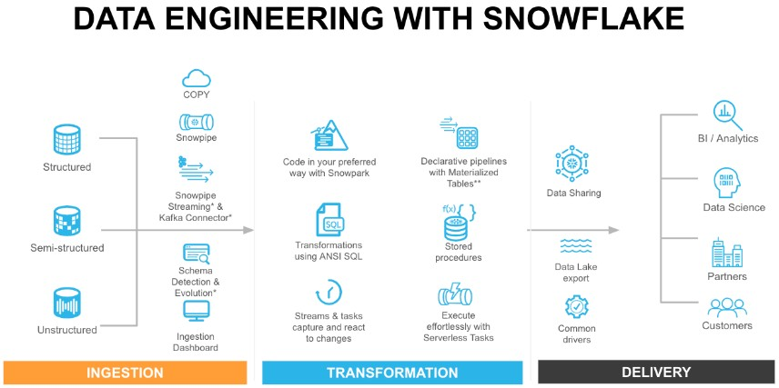

**Data Scientist with strong foundations in data engineering**, building scalable analytics and ML-ready data platforms for real-world business problems.

Over the past ~4 years, I’ve worked across the **US, UK, Spain, and Brazil** designing end-to-end data platforms using _dbt, Snowflake, Redshift, SQL, Python, and AWS_ in industries including airlines, sports, e-commerce, and IoT.

My work sits at the intersection of analytics engineering, data science, and applied ML, with particular interest on _causal inference_, _experimentation_, and _LLM-enabled systems_. I care deeply about data quality and statistical rigor as enablers of trustworthy AI and decision-making.

I hold a background in Mechanical Engineering from **UFRJ** (Federal Univeristy of Rio de Janeiro) and a Master’s in Economics & Public Policy from **UCLA** (University of California Los Angeles), with a full scholarship from the Lemann Foundation.

Earlier, I was the first employee at Stone Payments (NASDAQ: STNE) and founded an online math prep platform that helped low-income Brazilian students prepare for GRE and GMAT exams.

Throughout my journey, I’ve been recognized with awards and scholarships from _UCLA, Yale University, the Lemann Foundation, the General Electric Foundation, and The Club of Rome_.

# Projects

## **Data & Analytics Engineering**

### **1. Data Ingestion & Integration**
_Focus: reliable data movement, schema control, and cost-efficient storage_

- [Ingestion: dbt-DuckDB - Postgres → AWS S3 (Parquet)](#part-1-of-2---leveraging-dbt-duckdb-to-perform-an-ingestion-step-postgres---aws-s3-bucket-parquet)
- [ETL Pipeline: Crypto API → Tableau](#etl-pipeline-from-crypto-api-to-tableau-csv-with-dockerized-postgres-jupyter-notebook-and-python)

---

### **2. Transformation & Data Modeling**
_Focus: analytical correctness, business logic, and scalable modeling_

- [Transformation: dbt-Snowflake - S3 (Parquet) → Snowflake External Tables](#part-2-of-2---leveraging-dbt-snowflake-to-perform-a-transformation-step-parquet-in-s3---snowflake-external-tables---transformation-in-snowflake-via-dbt)
- [How to migrate an ETL to dbt](#migrating-etl-medallion-architecture-and-kimball-dimensional-modeling-to-dbt-with-dockerized-postgres-jupyter-notebook-and-dbt)
- [Fundamentals of Snowflake Architecture, Stored Procedures, Streams, and Tasks](#snowflake-architecture-stored-procedures-stream-and-tasks---fundamentals)

---

### **3. Change Data Capture & Slowly Changing Dimensions**
_Focus: historical correctness and temporal consistency_

- [Implementing CDC with SCD Techniques: CDC Source → SCD Type 2](#implementing-an-scd-type-2-dimension-from-a-cdc-source-using-snowflakess-stored-procedure-and-data-quality-checks)

---

### **4. Data Quality, Observability & Reliability**
_Focus: trust, monitoring, and CI/CD-driven quality guarantees_

- [Data Observability for Raw Stripe Data in S3 with CI/CD](#data-observability-for-raw-stripe-data-in-s3-with-ci-cd)
- [Lead Quality Process: S3 (Parquet, CSVs) → Postgres (Bronze / Silver / Gold)](#lead-quality-process-reading-parquet-and-csvs-from-s3---transforming-with-object-oriented-design---postgres-bronze-silver-gold-layers)

---

### **5. Analytics & Machine Learning Enablement**
_Focus: ML-ready data, feature pipelines, and reproducibility_

- [ETL for Machine Learning (Churn Prediction)](#etl-medallion-architecture-and-kimball-dimensional-modeling-for-machine-learning-churn-prediction-with-dockerized-postgres-jupyter-notebook-and-python)

## **Applied Data Science & Machine Learning**
_Tech Stack: Python (Pandas, NumPy, Statsmodels, scikit-learn, CausalInference)_

---

### **1. Causal Inference & Experimentation**
_Focus: estimating impact, not just predicting outcomes_

- [Causal Inference: Effect of a New Recommendation System](#causal-inference-propensity-score-matching--difference-in-differences-measuring-the-effect-of-a-new-recommendation-system-on-an-e-commerce-marketplace)
- [Causal Inference: Effect of a Customer-Satisfaction Program](#causal-inference-difference-in-differences-measuring-the-effect-of-a-new-customer-satisfaction-program-on-an-airline-company)

---

### **2. Applied Machine Learning & Predictive Modeling**
_Focus: translating data into actionable signals_

- [ETL for Machine Learning (Churn Prediction)](#etl-medallion-architecture-and-kimball-dimensional-modeling-for-machine-learning-churn-prediction-with-dockerized-postgres-jupyter-notebook-and-python)

---

### **3. Data Analysis & Modeling Foundations**
_Focus: analytical rigor, feature preparation, and reproducibility_

- [Data Cleaning: Preparing Categorical Data for Modeling](#data-cleaning---preparing-categorical-data-for-modeling)
- [Data Cleaning: Parsing Date and Time Zones for Modeling](#data-cleaning---parsing-date-and-time-zone-for-modeling)

## **Teaching, Mathematical Foundations & Statistical Thinking**
_Tech Stack: Quarto, Markdown, LaTeX, GitHub Pages_

---

### **Foundations of Data Science, Statistics & Causal Machine Learning**
_Focus: rigorous mathematical foundations, intuition-building, and applied causal reasoning_

- [Foundations of Data Science & Causal Machine Learning: A Mathematical Journey](#foundations-of-data-science--causal-machine-learning-a-mathematical-journey)

See all projects below!

---

## **Data & Analytics Engineering**

### **1. Data Ingestion & Integration**

#### Ingestion: dbt-DuckDB — Postgres → AWS S3 (Parquet)
[Check it out here!](https://github.com/caiocvelasco/project03-docker-dbt-DuckDB-from-postgres-to-s3-parquet.git)

This project uses a Dockerized environment to extract data from Postgres (as if it were data in "Production"). Then, it converts the data into Parquet files, saving them into an AWS S3 Bucket. I used my AWS Free Tier account and implemented the dbt-DuckDB adapter to expand dbt’s core functionality (transformation) into an ingestion layer.

---

#### ETL Pipeline: Crypto API → Tableau (CSV)
[Check it out here!](https://github.com/caiocvelasco/project01-docker-ETL-from-API-CSV-to-Tableau.git)

This ETL pipeline uses Python functions to extract data from an external API and transform it into CSV files for downstream consumption by Tableau or other visualization tools. The project runs in a Dockerized environment with PostgreSQL and Jupyter Notebook for interactive exploration.

---

### **2. Transformation & Data Modeling**

#### Transformation: dbt-Snowflake — S3 (Parquet) → Snowflake External Tables
[Check it out here!](https://github.com/caiocvelasco/project03-docker-dbt-from-s3-parquet-to-Snowflake-external-tables)

This project extracts Parquet files stored in S3 using Snowflake External Tables. dbt performs transformations and materializes dimension and fact tables in the Silver layer, along with aggregated tables in the Gold schema, following the Medallion Architecture and Kimball Dimensional Modeling.

---

#### Migrating ETL (Medallion Architecture & Kimball Modeling) to dbt
[Check it out here!](https://github.com/caiocvelasco/project02-docker-dbt-migration-medallion-kimball-postgres.git)

This project expands a previous Python-based ETL to simulate a real-world migration to dbt. Data is extracted from multiple CSV files, and transformation and loading are performed in PostgreSQL via dbt, following Bronze, Silver, and Gold layers and a star schema design.

---

#### Fundamentals of Snowflake Architecture, Stored Procedures, Streams, and Tasks
[Check it out here!](https://github.com/caiocvelasco/snowflake-fundamentals-data-engineering)

This guide covers four essential pillars of Snowflake mastery:
1. Snowflake Architecture & Performance Fundamentals  
2. Procedural SQL, Streams & Tasks  
3. AWS S3 Integration & Data Loading  
4. Orchestration & ELT Design

---

### **3. Change Data Capture & Slowly Changing Dimensions**

#### Implementing CDC with SCD Type 2 in Snowflake
[Check it out here!](https://github.com/caiocvelasco/project06-venv-cdc-scd-type-2-stored-procedure-snowflake)

This project implements a Slowly Changing Dimension (SCD) Type 2 to track historical changes in product status using a CDC stream as the source. The pipeline ensures ordered, deduplicated events, idempotency, and basic data quality checks via stored procedures.

---

### **4. Data Quality, Observability & Reliability**

#### Data Observability for Raw Stripe Data in S3 with CI/CD
[Check it out here!](https://github.com/caiocvelasco/project09-meltano-s3-dbt-snowflake-observability-ci-cd/tree/main/)

This project provides a lightweight observability layer for raw Stripe data ingested into S3 via Meltano. The goal is to validate the raw layer before downstream transformations.

Key features include:
- File presence and content validation  
- Schema validation and early drift detection  
- Single orchestration entrypoint  
- Secure AWS integration via `boto3`  
- CI/CD support through GitHub Actions  

---

#### Lead Quality Process: S3 → Postgres (Bronze / Silver / Gold)
[Check it out here!](https://github.com/caiocvelasco/project05-docker-s3-csv-parquet-object-oriented-leads-quality)

This project uses a Dockerized environment to extract Parquet and CSV data from S3 and load it into PostgreSQL, following the Medallion Architecture and object-oriented transformation design.

---

### **5. Analytics & Machine Learning Enablement**

#### ETL for Machine Learning (Churn Prediction)
[Check it out here!](https://github.com/caiocvelasco/project02-docker-medallion-postgres-kimball-star-schema.git)

This project builds an end-to-end Python ETL pipeline designed for machine learning use cases. The pipeline runs in Docker, uses PostgreSQL and Jupyter Notebook, and follows the Medallion Architecture and Kimball star schema to produce ML-ready feature tables.

## **Applied Data Science & Machine Learning**

### **1. Causal Inference & Experimentation**

#### Causal Inference (Propensity Score Matching & Difference-in-Differences):  
Measuring the Effect of a New Recommendation System on an E-Commerce Marketplace

[Check it out here!](https://github.com/caiocvelasco/project08-venv-causal-inference-propensity-score-difference-in-differences-program-evaluation.git)

---

#### Causal Inference (Difference-in-Differences):  
Measuring the Effect of a New Customer-Satisfaction Program on an Airline Company

[Check it out here!](https://github.com/caiocvelasco/project07-venv-causal-inference-difference-in-differences-program-evaluation.git)

---

### **2. Data Analysis & Modeling Foundations**
_Focus: analytical rigor, feature preparation, and statistical best practices_

#### Data Cleaning: Preparing Categorical Data for Modeling
[Check it out here!](https://github.com/caiocvelasco/cleaning-categorical-data-best-practices.git)

When datasets are large, it can take forever for a Machine Learning model to make predictions. This project focuses on storing and encoding categorical data efficiently without changing dataset size.

---

#### Data Cleaning: Parsing Date and Time Zones for Modeling
[Check it out here!](https://github.com/caiocvelasco/cleaning-categorical-data-best-practices.git)

Best practices for parsing, standardizing, and validating date, time, and time zone data prior to modeling.

---

#### Data Analysis & Inferential Statistics with Python
[Check it out here!](https://github.com/caiocvelasco/cardio-covid-project.git)

 

## **Advanced Mathematics, Statistics, and Machine Learning**

I have a strong interest in teaching and in building clear bridges between mathematical foundations, statistical reasoning, and real-world data science practice. I care deeply about rigor, intuition, and the responsible use of quantitative methods in decision-making.

---

### **Foundations of Data Science & Causal Machine Learning: A Mathematical Journey**

I’m developing a long-term open study book (and future course) focused on the mathematical and statistical foundations underlying Data Science, Econometrics, and Causal Machine Learning. The goal is to make advanced concepts accessible without sacrificing rigor, and to connect theory directly to modern ML and applied data problems.

The project is freely available online:

[Foundations of Data Science & Causal Machine Learning – A Mathematical Journey](https://caiocvelasco.github.io/math-journey-data-science-causal-machine-learning/)
