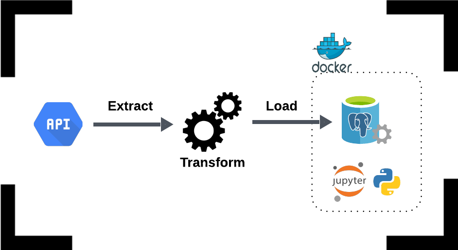
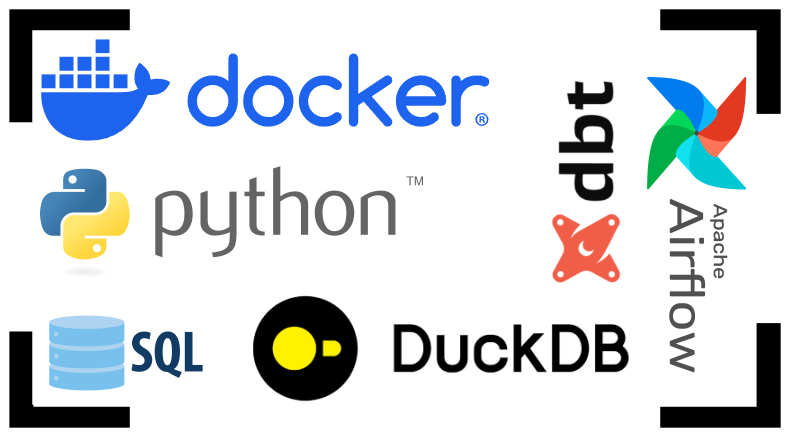

<html lang="en">
<head>
  <meta charset="UTF-8">
  <meta name="viewport" content="width=device-width, initial-scale=1.0">
  <meta property="og:image" content="https://caiocvelasco.github.io/assets/img/etl.png"> <!-- Change this URL to the image you want -->
  <meta property="og:url" content="https://github.com/caiocvelasco/caiocvelasco.github.io">
  <title>Caio Velasco</title>
</head>
<body>
</body>
</html>

I'm a Mechanical Engineer from Brazil with a Master in Economics & Public Policy from the University of California Los Angeles (UCLA). 

In 2021, because of the pandemic, I decided to stop a Ph.D. in Economics in the Netherlands and transition into **Data Science**.

My professional experiences ranges from Business Analysis, Product Ownership, and Consulting to Data Engineering and Data Science. I also have basic knowledge of Corporate Finance and very good communication skills.

My academic experience includes Advanced Math, Statistics, Economics, and Econometrics (Multiple Regression, Causal Inference, Difference in Differences, Instrumental Variables, Time Series).

I grew up in Rio de Janeiro and education was the only weapon I had to succeed in life. As a consequence of my efforts, I was awarded by Yale University, UCLA, General Electric Foundation, Lemann Foundation, and The Club of Rome.

I have a very technical profile, but I also bring strong business and entrepreneurial skills to the table. In the past, I helped build Stone Payments, a famous Brazilian FinTech payment company (NASDAQ: STNE). Moreover, I created my own mathematics digital product (MePrepara) with over 140 videos teaching low-income Brazilian students who want to take the GMAT and GRE exams and apply for MBA/PhD abroad.

Thank you for visiting :)

## Projects
---

### (Work in Progress) ETL Pipeline from Crypto API to PowerBI (with Dockerized Postgres, Jupyter Notebook, and Python)

[Work in Progress - Check it out here!](https://github.com/caiocvelasco/project01-docker-ETL-from-API-to-PowerBI.git)

--- 

### (Work in Progress) End-to-End Data Science Project with Docker, DuckDB, dbt, Airflow, Python & SQL

[Work in Progress - Check it out here!](https://github.com/caiocvelasco/end-to-end-data-science-project.git)

--- 

### Data Analysis with Python and Inferential Statistics

[Healthcare Cardio & Covid Data Analysis](https://github.com/caiocvelasco/cardio-covid-project.git)

--- 

## Sharing Knowledge

As hobbies, I play football competitively (forward), it's my passion. I have played in amateur leagues in Brazil, USA, and the Netherlands. I also have a strong passion for teaching and educating others. A personal characteristic I am proud of is the ability to transform very complex subjects into intuitive topics for any audience.

I find happiness in the little things in life and I also learned a lot from every mistake I have made so far (and still do).

---

### Statistics & Data Science
I have a passion for teaching and I have been trained by amazing professors in top notch universities around the globe.

Therefore, I have started to write a book that belongs to a (future) course I call "**An Intuitive Course in Probability (and Statistics)**, _for data science_. The idea is to provide strong intuition for every major concept while keeping the mathematical formalization and rigor very close. I had this idea after taking a Probability Theory course from MIT. I am a fan. It will be available both in English and Portuguese.

Please, check the English version [here](https://caiocvelasco.github.io/assets/my_course/An_Intuitive_Course_in_Probability__draft_EN.pdf) and the Portuguese version [aqui!](https://caiocvelasco.github.io/assets/my_course/Um_Curso_Intuitivo_de_Probabilidade__draft_PT.pdf)

It's a working in progress, so you may find only part of Chapter 1 now.

### Math
Sometimes, I try to contribute to some interesting communities. You can check an example below.

* Math StackExchange\
Here is an [example](https://math.stackexchange.com/a/3444354/727414).